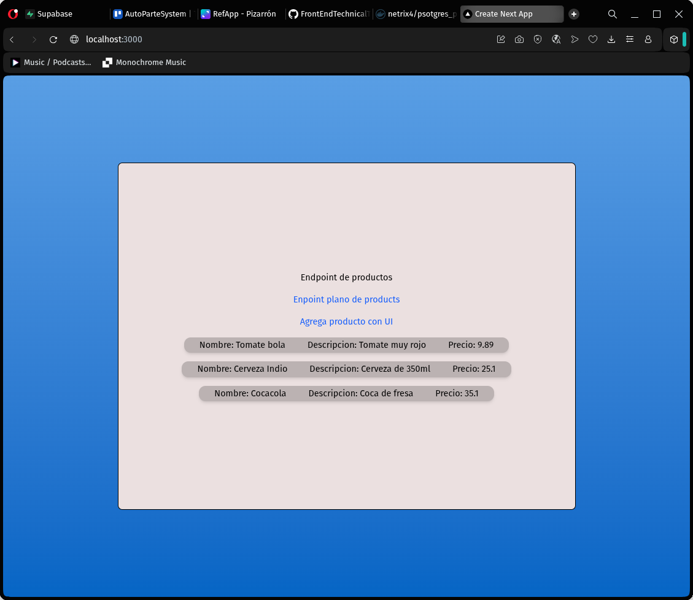
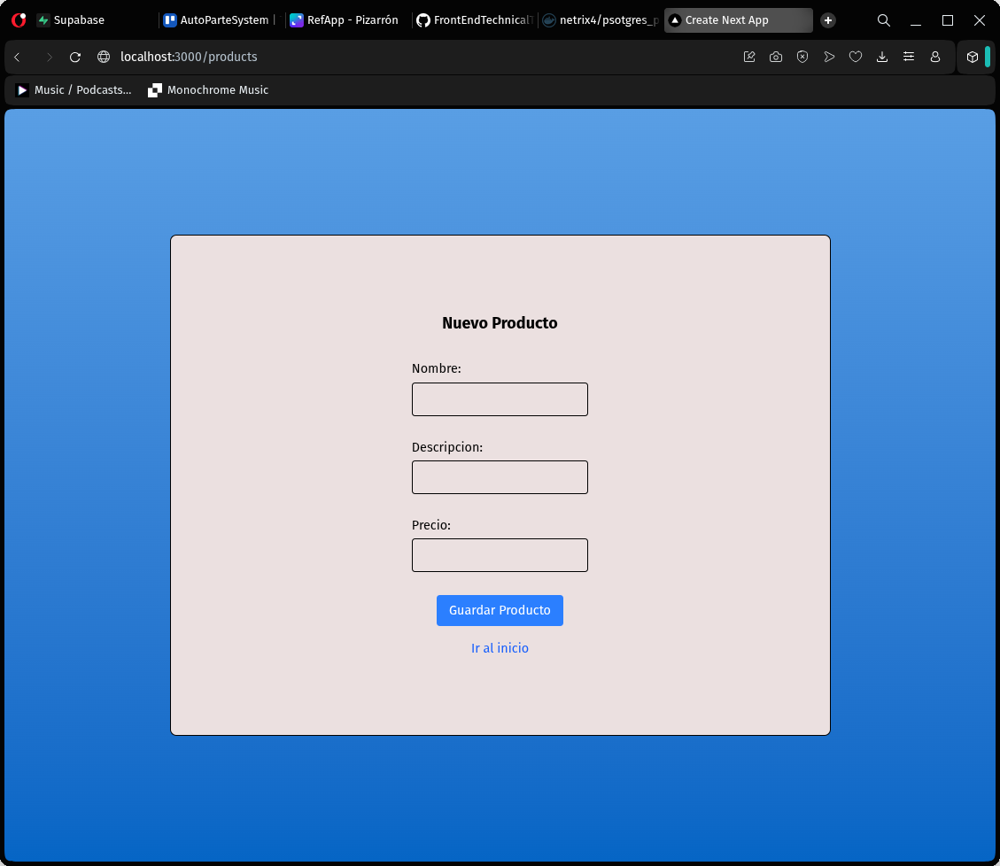
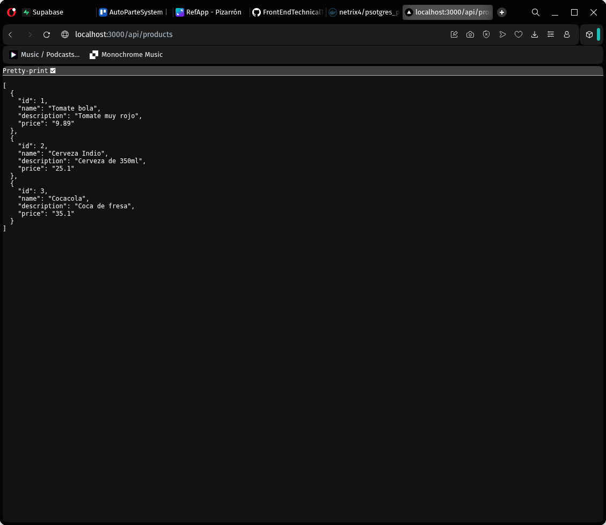

# APITechnicalTest

Documentacion tecnica para prueba tecnica

"/" del la aplicacion creada en esta prueba tecnica

## Requisitos e instalacion

docker con sesion iniciada

checar si hay algun contenedor corriendo, si es el caso
`docker ps -a` si es el caso

`docker stop $(docker ps -a -q) && docker rm $(docker ps -a -q)`

uso anidado de 4 comandos de docker para limpiar ejecuciones alternas (solo neceario si hay contenendores de next o postgress en el mismo cliente host de docker)

remover archivos de contenedores alternos o versiones viejas del build de esta misma aplicacion

`docker compose down -v`

`docker compose down --remove-orphans`

\*Nota, ejecuciones alterna no dockerizadas tambien pueden interferir en la ejecucion del build y funcionamiento de esta aplicacion.

## Variables de entorno

Variables privada de entorno necesarias para poder usar el API y la base de datos (SQLite)

| Nombre de variable | Descripcion                                 |
| ------------------ | ------------------------------------------- |
| DATABASE_URL       | Dominio de la api de autenticacion          |
| POSTGRES_USER      | Usuario creado en el motor de base de datos |
| POSTGRES_PASSWORD  | Contraseña apara el mismo                   |
| POSTGRES_DB        | nombre de la base de datos                  |

## Uso

Teniendo nuestro host limpio de otros contenedores:

`docker compose up --build -d`

generamos una instancia de la imagen de my aplicacion de Next y una de mi instancia preconfigurada de PostgreSQL
ambas proporcionada en este repositorio por el mismo Dockerfile.

Cabe recalcar que la imagen necesaria de postgres es propia y esta alojada en DockerHub y se puede consultar como

- [netrix4/psotgress_preconfig:v1.1](https://hub.docker.com/repository/docker/netrix4/psotgres_preconfig/general)

Al terminar la generacion del contenedor estaran corriendo dos contenedores, `LKMXTECHTESTNEXTJSContainer` y `LKMXTECHTESTDBContainer` en el puerto 3000 y 5432 respectivamente.

Ahora podemos ir a localhost:3000 o su equivalente en el puerto 3000 y consultar la aplicacion en cuestion.

## Rutas

_Inicio_ o '/'

Esta es la ruta principal del proyecto web

`/products/`

Pagina para agregar un producto nuevo mediante un form basico,

`/api/products/` (POST)

Endpoint para agregar un producto

`/api/products/` (GET)

Endpoint para consultar todos los productos

`/api/products/{id}`

Endpoint de consulta de un producto por id

`/api/analytics/`

Enpoint para consultar los producto con mayor costo a 30 debido a requirimientos de negocio (endpoint de agregacion)

### Comentarios adicionales

La realizacion de esta dockerizacion enfrentó importantes adversidades debido a la liberacion de versiones recientes inestables de docker y PostgrereSQL demorando horas lo que debió tomar minutos. En todo caso: el objetivo se logro.
